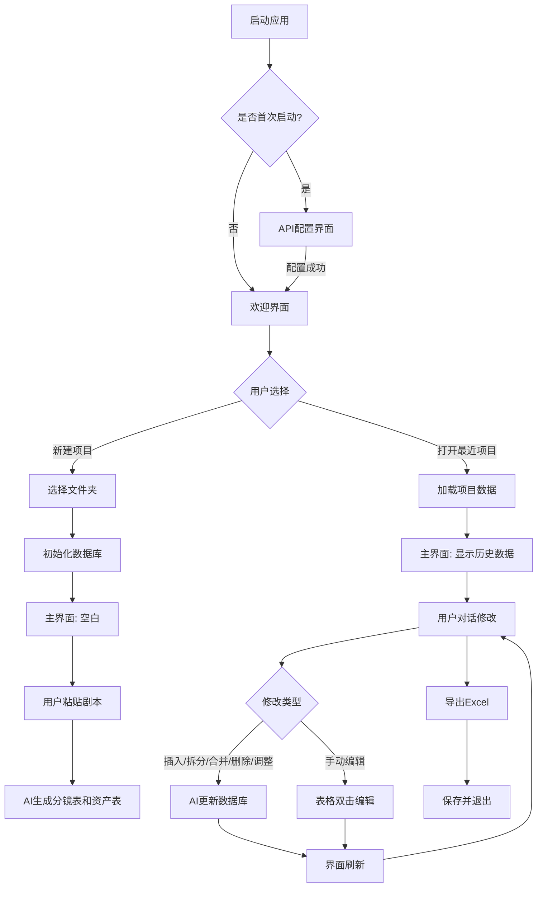
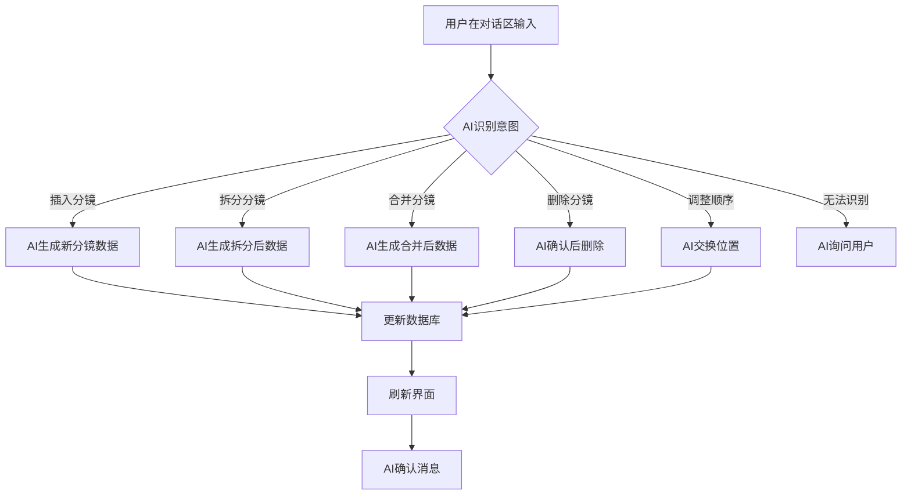

# 产品需求文档：分镜师 - V1.0

## 1. 综述 (Overview)

### 1.1 项目背景与核心问题

视频创作者在制作视频前需要先制作分镜表，将剧本拆解成一个个镜头，标注镜头类型、景别、时长、画面描述等信息。传统方式是在Excel或专业软件中手动制作，效率低下且难以修改。

**"分镜师"** 是一款桌面应用，通过AI帮助用户快速生成分镜表，并支持通过自然语言对话进行迭代修改（插入、拆分、合并、删除、调整顺序等），大幅提升分镜制作效率。

**核心价值**：
- 剧本一键转分镜表：粘贴剧本，AI自动生成分镜表和资产表（角色/场景/道具）
- 对话式迭代：用自然语言告诉AI如何修改分镜，无需手动操作
- 专业输出：支持导出Excel，包含生图提示词和生视频提示词（V1.0为文本，V2.0对接生成API）

### 1.2 核心业务流程 / 用户旅程地图

1.  **阶段一：项目初始化** - 创建项目文件夹，配置API，准备接收剧本输入
2.  **阶段二：AI生成与迭代** - 粘贴剧本，AI生成分镜表；通过对话多轮修改（插入/拆分/合并/删除/调整顺序）
3.  **阶段三：手动精修** - 直接在表格中双击编辑，新增/删除行
4.  **阶段四：导出与保存** - 导出Excel文件，或保存项目下次继续

### 1.3 Mermaid 图（流程/状态/时序）

> 说明：Mermaid 图用于"需求对齐"，避免歧义；避免写成技术实现细节（不要写 API 路径、字段、HTTP code、框架/库）。

#### 1.3.1 核心用户操作流（必填）



#### 1.3.2 对话式修改流程



---

## 2. 用户故事详述 (User Stories)

### 阶段一：项目初始化

---

#### **US-01: 项目初始化与剧本输入**

**价值陈述 (Value Statement)**:
- **作为** 视频创作者
- **我希望** 快速创建一个新项目并让AI帮我生成分镜表
- **以便于** 省去手动在Excel中逐行填写分镜信息的繁琐工作

**业务规则与逻辑 (Business Logic)**:
1.  **前置条件**:
    - 首次启动必须配置至少一个text类型的API
    - API配置测试通过才能继续

2.  **操作流程 (Happy Path)**:
    - **首次启动**：
        1. 进入API配置界面
        2. 添加API（名称、端点、密钥）
        3. 选择API类型（text/image/video）
        4. 测试连接成功
        5. 进入欢迎界面
    - **新建项目**：
        1. 点击【新建项目】
        2. 选择文件夹（检测是否已有项目文件）
        3. 初始化数据库
        4. 进入主界面
        5. AI欢迎消息，引导用户粘贴剧本
        6. 用户粘贴剧本（≤2万字）
        7. AI分析剧本，推荐3-4种风格
        8. 用户确认风格
        9. AI生成分镜表和资产表
    - **打开历史项目**：
        1. 点击最近项目列表中的项目名
        2. 检测项目文件夹有效性
        3. 加载项目数据和对话历史（最近20条）
        4. 进入主界面，恢复状态
        5. AI总结进度并引导下一步

3.  **异常处理 (Error Handling)**:
    - **API配置失败**：提示具体错误原因（网络、密钥错误等）
    - **文件夹权限不足**：提示"无法访问该文件夹，请选择其他位置"
    - **数据库已存在**：提示"该文件夹已包含项目，是否打开？"
    - **数据库损坏**：提示"项目数据损坏，无法打开"
    - **Token超限**：提示"内容过长，请分段输入"（V1.1支持文件上传）
    - **剧本无法识别**：AI询问"无法识别为剧本，请确认格式"

**验收标准 (Acceptance Criteria)**:
- **场景1: 首次启动配置API**
    - **GIVEN** 用户首次启动应用
    - **WHEN** 用户进入API配置界面并添加一个text类型API
    - **THEN** 测试通过后进入欢迎界面
- **场景2: 新建项目并生成分镜**
    - **GIVEN** 用户在欢迎界面
    - **WHEN** 用户点击【新建项目】，选择文件夹，粘贴剧本
    - **THEN** AI生成分镜表和资产表并显示在界面上
- **场景3: 打开历史项目**
    - **GIVEN** 用户有之前编辑的项目
    - **WHEN** 用户点击最近项目列表中的项目名
    - **THEN** 项目数据加载完成，界面恢复到上次状态

**页面布局线框图 (ASCII Wireframe)**:

```text
┌─────────────────────────────────────────────────────────────────────────────┐
│  文件 │ 配置 │ 项目名 │ [▦ ▦ ▦] │ [─][□][✕]                              │
├──────────────┬──────────────────────────────────────────────────────────────┤
│              │  分镜表                                                     │
│   分镜表     │  ┌────┬────────┬────────┬────────┬──────────────────────────┐│
│   角色       │  │序号│  镜号  │镜头类型│  景别  │          画面描述         ││
│   场景       │  ├────┼────────┼────────┼────────┼──────────────────────────┤│
│   道具       │  │ 1  │   1    │  固定  │  远景  │  客厅全景，晨光透过窗户... ││
│              │  │ 2  │   2    │  推近  │  中景  │  主角从沙发上站起来...     ││
│              │  │ 3  │   3    │  跟拍  │  特写  │  主角的手部特写...         ││
│              │  └────┴────────┴────────┴────────┴──────────────────────────┘│
├──────────────┴──────────────────────────────────────────────────────────────┤
│  🤖 AI                                                                ↑    │
│  ├───────────────────────────────────────────────────────────────────┤    │
│  │ 欢迎使用分镜师！请粘贴您的剧本，我将为您生成分镜表。                 │    │
│  │                                                                  │    │
│  └───────────────────────────────────────────────────────────────────┤    │
│  [请输入消息或粘贴剧本...]                                           |    │
│  [发送]                                                              │    │
└─────────────────────────────────────────────────────────────────────────────┘
```

---

#### **US-02: 项目设置界面（V1.0简化版）**

**价值陈述 (Value Statement)**:
- **作为** 项目编辑者
- **我希望** 查看项目的基本信息和元数据
- **以便于** 了解项目当前状态

**业务规则与逻辑 (Business Logic)**:
1.  **前置条件**: 已打开一个项目
2.  **操作流程 (Happy Path)**:
    - 点击【配置】→【项目设置】
    - 显示项目元数据（名称、路径、创建时间、最后修改时间、分镜数量、对话轮数）
    - V1.0显示"暂无可配置项"说明
    - 显示V2.0功能预告（台词处理、字幕生成），标记为不可编辑
    - 点击【关闭】退出
3.  **异常处理**: 无

**验收标准 (Acceptance Criteria)**:
- **场景1: 查看项目信息**
    - **GIVEN** 用户已打开项目
    - **WHEN** 用户点击【配置】→【项目设置】
    - **THEN** 显示完整的项目元数据
- **场景2: V1.0功能提示**
    - **GIVEN** 用户在项目设置界面
    - **WHEN** 用户查看配置项
    - **THEN** 显示"暂无可配置项"和V2.0功能预告

**页面布局线框图 (ASCII Wireframe)**:

```text
┌─────────────────────────────────────────────────────────────────────────────┐
│  项目设置                                                    [关闭]         │
├─────────────────────────────────────────────────────────────────────────────┤
│  📁 项目信息                                                                │
│  ┌─────────────────────────────────────────────────────────────────────────┐│
│  │  项目名称：我的分镜项目                                                  ││
│  │  项目路径：D:\Projects\我的分镜项目                                      ││
│  │  创建时间：2025-02-05 10:30                                             ││
│  │  最后修改：2025-02-05 15:45                                             ││
│  │  分镜数量：15个                                                         ││
│  │  对话轮数：28轮                                                         ││
│  └─────────────────────────────────────────────────────────────────────────┘│
│                                                                              │
│  ⚙️ 分镜生成配置（V1.0）                                                     │
│  ┌─────────────────────────────────────────────────────────────────────────┐│
│  │  V1.0版本分镜由AI自动处理，暂无可配置项。                                ││
│  └─────────────────────────────────────────────────────────────────────────┘│
│                                                                              │
│  🎬 视频生成配置（V2.0）                                                     │
│  ┌─────────────────────────────────────────────────────────────────────────┐│
│  │  ⚠️ 以下功能将在V2.0版本推出                                             ││
│  │  ☐ 台词处理方式：[智能判断]                                              ││
│  │  ☐ 是否生成字幕：[否]                                                   ││
│  └─────────────────────────────────────────────────────────────────────────┘│
│                                                                              │
│  🔄 自动保存（V1.1）                                                         │
│  ┌─────────────────────────────────────────────────────────────────────────┐│
│  │  ⚠️ 以下功能将在V1.1版本推出                                             ││
│  │  ☐ 自动保存间隔：[5分钟]                                                ││
│  └─────────────────────────────────────────────────────────────────────────┘│
│                                                                              │
│                                                                              │
│                                          [关闭]                              │
└─────────────────────────────────────────────────────────────────────────────┘
```

---

### 阶段二：AI生成与迭代

---

#### **US-03: AI生成分镜表和资产表**

**价值陈述 (Value Statement)**:
- **作为** 视频创作者
- **我希望** 粘贴剧本后AI自动生成分镜表和资产表
- **以便于** 快速开始分镜工作，无需手动逐行填写

**业务规则与逻辑 (Business Logic)**:
1.  **前置条件**:
    - 项目已初始化
    - 已配置text类型API

2.  **操作流程 (Happy Path)**:
    - **风格引导**：
        1. 用户粘贴剧本
        2. AI分析剧本类型和风格
        3. AI推荐3-4种适合的风格并说明特点
        4. 用户选择或自定义风格
        5. AI生成专业的中英文双语风格提示词
        6. 风格提示词保存到项目设置
    - **生成分镜表**：
        1. AI解析剧本，识别镜头
        2. 生成13个字段的分镜数据
        3. 生成资产表（角色/场景/道具）
        4. 保存到数据库
        5. 界面显示生成的数据
        6. AI总结生成结果

3.  **异常处理 (Error Handling)**:
    - **剧本无法识别**：AI询问"无法识别为剧本，请确认格式"
    - **JSON格式错误**：AI重新生成
    - **数据库保存失败**：提示"保存失败，请重试"
    - **Token超限**：提示"内容过长，请分段输入"

**验收标准 (Acceptance Criteria)**:
- **场景1: 风格引导流程**
    - **GIVEN** 用户粘贴剧本
    - **WHEN** AI分析完成
    - **THEN** 推荐3-4种风格供用户选择
- **场景2: 生成分镜表和资产表**
    - **GIVEN** 用户确认风格
    - **WHEN** AI生成完成
    - **THEN** 显示完整的分镜表和资产表

**数据结构定义**:

| 表名 | 字段 |
|------|------|
| **分镜表** | 序号、镜号、镜头类型、景别、时长、对白旁白、画面描述、备注、生图提示词首帧中文、生图提示词首帧英文、生图提示词尾帧中文、生图提示词尾帧英文、生视频提示词中文 |
| **角色表** | ID、名称、角色描述、生图提示词中文、生图提示词英文、备注 |
| **场景表** | ID、名称、场景描述、生图提示词中文、生图提示词英文、备注 |
| **道具表** | ID、名称、道具描述、生图提示词中文、生图提示词英文、备注 |

---

#### **US-04: 插入分镜**

**价值陈述 (Value Statement)**:
- **作为** 分镜编辑者
- **我希望** 通过对话在指定位置插入新分镜
- **以便于** 快速补充遗漏的镜头

**业务规则与逻辑 (Business Logic)**:
1.  **前置条件**: 已有分镜表
2.  **操作流程 (Happy Path)**:
    - 用户在对话区说"在第8镜后面插入一个XXX分镜"
    - AI解析意图，识别插入位置和内容
    - AI生成新分镜的完整数据（所有字段）
    - 数据库插入新分镜
    - 序号自动重新编号
    - 界面刷新
    - AI确认插入结果
3.  **异常处理**:
    - 镜号不存在：提示"未找到镜号#8，请确认"
    - 描述不完整：AI询问"请描述新分镜的内容"

**验收标准 (Acceptance Criteria)**:
- **场景1: 插入单个分镜**
    - **GIVEN** 用户有分镜表
    - **WHEN** 用户说"在第8镜后面插入一个特写分镜"
    - **THEN** 在第8镜后插入新分镜，序号重排
- **场景2: 插入多个分镜**
    - **GIVEN** 用户有分镜表
    - **WHEN** 用户说"在第5镜后插入两个分镜，XXX和YYY"
    - **THEN** 在第5镜后依次插入两个新分镜

---

#### **US-05: 拆分分镜**

**价值陈述 (Value Statement)**:
- **作为** 分镜编辑者
- **我希望** 将一个复杂分镜拆分成多个更精细的分镜
- **以便于** 更好地表现镜头细节

**业务规则与逻辑 (Business Logic)**:
1.  **前置条件**: 已有分镜表
2.  **操作流程 (Happy Path)**:
    - 用户在对话区说"把第8镜拆成2个，第一个是XXX，第二个是YYY"
    - AI解析意图，识别镜号、拆分数量、各分镜描述
    - AI验证镜号存在、描述完整
    - AI生成拆分后的分镜数据
    - 数据库删除原分镜，插入新分镜
    - 序号自动重新编号
    - 镜号：`#8` → `#8-1`, `#8-2`
    - 界面刷新
    - AI确认拆分结果
3.  **异常处理**:
    - 镜号不存在：提示"未找到镜号#8，请确认"
    - 拆分数量>3：提示"最多支持拆分成3个分镜"
    - 描述不完整：AI询问缺少的分镜描述

**验收标准 (Acceptance Criteria)**:
- **场景1: 拆分成两个分镜**
    - **GIVEN** 用户有分镜表
    - **WHEN** 用户说"把第8镜拆成2个，第一个是XXX，第二个是YYY"
    - **THEN** 原分镜删除，插入#8-1和#8-2，序号重排
- **场景2: 描述不完整时AI询问**
    - **GIVEN** 用户说"把第8镜拆成2个，第一个是XXX"
    - **WHEN** 用户没描述第二个分镜
    - **THEN** AI询问"请描述第二个分镜的内容"

---

#### **US-06: 合并分镜**

**价值陈述 (Value Statement)**:
- **作为** 分镜编辑者
- **我希望** 将相邻分镜合并成一个更精简的分镜
- **以便于** 简化过于细碎的分镜

**业务规则与逻辑 (Business Logic)**:
1.  **前置条件**: 已有分镜表
2.  **操作流程 (Happy Path)**:
    - 用户在对话区说"把8号和9号合并，内容是XXX"
    - AI解析意图，识别镜号、合并内容
    - AI验证镜号存在、是否相邻
    - AI生成合并后的分镜数据（完整一行所有字段）
    - 数据库删除原分镜，插入新分镜
    - 序号自动重新编号
    - 镜号由AI决定
    - 界面刷新
    - AI确认合并结果
3.  **异常处理**:
    - 镜号不存在：提示"未找到镜号8号，请确认"
    - 分镜不相邻：提示"8号和10号不相邻，无法合并"
    - 合并数量>3：提示"最多支持合并3个分镜"

**验收标准 (Acceptance Criteria)**:
- **场景1: 合并相邻分镜**
    - **GIVEN** 用户有分镜表
    - **WHEN** 用户说"把8号和9号合并"
    - **THEN** 两个分镜删除，插入新分镜，序号重排
- **场景2: 不相邻分镜提示**
    - **GIVEN** 用户有分镜表
    - **WHEN** 用户说"把8号和10号合并"
    - **THEN** AI提示"8号和10号不相邻，无法合并"

---

#### **US-07: 删除分镜**

**价值陈述 (Value Statement)**:
- **作为** 分镜编辑者
- **我希望** 删除不需要的分镜
- **以便于** 清理多余的内容

**业务规则与逻辑 (Business Logic)**:
1.  **前置条件**: 已有分镜表
2.  **操作流程 (Happy Path)**:
    - 用户在对话区说"删除8号"或"删除8号到10号"
    - AI解析意图，识别要删除的镜号
    - AI验证镜号存在、数量≤3
    - AI显示确认消息：列出要删除的分镜
    - 用户确认
    - 数据库删除分镜
    - 序号自动重新编号
    - 界面刷新
    - AI确认删除结果
3.  **异常处理**:
    - 镜号不存在：提示"未找到镜号8号，请确认"
    - 删除数量>3：提示"单次最多删除3个分镜"
    - 用户取消：提示"已取消删除"

**验收标准 (Acceptance Criteria)**:
- **场景1: 删除单个分镜**
    - **GIVEN** 用户有分镜表
    - **WHEN** 用户说"删除8号"并确认
    - **THEN** 8号分镜删除，序号重排
- **场景2: 删除多个分镜**
    - **GIVEN** 用户有分镜表
    - **WHEN** 用户说"删除8号到10号"并确认
    - **THEN** 8、9、10号分镜删除，序号重排
- **场景3: 需要确认**
    - **GIVEN** 用户说"删除8号和9号"
    - **WHEN** AI列出要删除的分镜
    - **THEN** 用户确认后才执行删除

**界面交互**:

```text
┌─────────────────────────────────────────────────────────────────────────────┐
│  👤 用户                                                                     │
│  删除8号和9号                                                                │
├─────────────────────────────────────────────────────────────────────────────┤
│  🤖 AI                                                                       │
│  确认删除以下分镜？                                                          │
│  • 8号: 主角从床上坐起的特写 (3秒)                                           │
│  • 9号: 主角走到窗边的远景 (5秒)                                             │
│                                                                              │
│  [确认删除] [取消]                                                           │
├─────────────────────────────────────────────────────────────────────────────┤
│  👤 用户                                                                     │
│  确认                                                                        │
├─────────────────────────────────────────────────────────────────────────────┤
│  🤖 AI                                                                       │
│  ✅ 已删除2个分镜，当前共14个分镜。                                           │
└─────────────────────────────────────────────────────────────────────────────┘
```

---

#### **US-08: 调整分镜顺序**

**价值陈述 (Value Statement)**:
- **作为** 分镜编辑者
- **我希望** 交换两个分镜的位置
- **以便于** 调整镜头的叙事顺序

**业务规则与逻辑 (Business Logic)**:
1.  **前置条件**: 已有分镜表
2.  **操作流程 (Happy Path)**:
    - 用户在对话区说"把8号和15号交换"
    - AI解析意图，识别要交换的镜号
    - AI验证镜号存在
    - 数据库交换两个分镜的位置
    - 序号自动重新编号
    - 镜号由AI重新生成
    - 界面刷新
    - AI确认交换结果
3.  **异常处理**:
    - 镜号不存在：提示"未找到镜号20号，请确认"
    - 意图无法识别：AI询问"抱歉没理解，您是想交换哪两个分镜？"

**验收标准 (Acceptance Criteria)**:
- **场景1: 交换任意两个分镜**
    - **GIVEN** 用户有分镜表
    - **WHEN** 用户说"把8号和15号交换"
    - **THEN** 两个分镜位置交换，镜号和序号更新
- **场景2: 意图无法识别时AI询问**
    - **GIVEN** 用户表达不清晰
    - **WHEN** AI无法识别意图
    - **THEN** AI询问用户

---

### 阶段三：手动精修

---

#### **US-10: 手动编辑表格**

**价值陈述 (Value Statement)**:
- **作为** 分镜编辑者
- **我希望** 直接在表格中双击编辑单元格
- **以便于** 快速微调分镜内容，无需通过对话

**业务规则与逻辑 (Business Logic)**:
1.  **前置条件**: 已有分镜表
2.  **操作流程 (Happy Path)**:
    - 用户双击表格单元格
    - 单元格进入编辑状态
    - 用户编辑内容
    - 用户按Enter/Tab/点击其他单元格/失焦
    - 自动保存到数据库
    - 界面刷新显示更新后的内容
3.  **异常处理**:
    - 时长格式错误：提示"时长必须是数字"，拒绝保存
    - 数据库保存失败：提示"保存失败，请重试"

**可编辑字段**:

| 字段 | 可编辑 | 说明 |
|------|--------|------|
| 序号 | ❌ 不可编辑 | 系统自动生成，增删行时重排 |
| 镜号 | ✅ 可编辑 | 用户可自定义镜号格式 |
| 镜头类型 | ✅ 可编辑 | 下拉选择或手动输入 |
| 景别 | ✅ 可编辑 | 下拉选择或手动输入 |
| 时长 | ✅ 可编辑 | 需验证为数字格式 |
| 对白旁白 | ✅ 可编辑 | 文本输入 |
| 画面描述 | ✅ 可编辑 | 文本输入 |
| 备注 | ✅ 可编辑 | 文本输入 |
| 所有提示词字段 | ✅ 可编辑 | 文本输入 |

**编辑交互规则**:

| 操作 | 行为 |
|------|------|
| **双击单元格** | 进入编辑状态 |
| **按 Enter** | 保存当前编辑，跳到下一行同列 |
| **按 Tab** | 保存当前编辑，跳到右侧单元格 |
| **按 Esc** | 取消编辑，恢复原值 |
| **失焦** | 自动保存到数据库 |

**验收标准 (Acceptance Criteria)**:
- **场景1: 双击编辑单元格**
    - **GIVEN** 用户有分镜表
    - **WHEN** 用户双击单元格
    - **THEN** 单元格进入编辑状态
- **场景2: 按Enter保存**
    - **GIVEN** 单元格在编辑状态
    - **WHEN** 用户按Enter
    - **THEN** 保存并跳到下一行同列
- **场景3: 按Esc取消**
    - **GIVEN** 单元格在编辑状态
    - **WHEN** 用户按Esc
    - **THEN** 取消编辑，恢复原值
- **场景4: 时长格式验证**
    - **GIVEN** 用户编辑时长字段
    - **WHEN** 用户输入非数字内容
    - **THEN** 提示"时长必须是数字"，拒绝保存

**界面设计**:

```text
┌─────────────────────────────────────────────────────────────────────────────┐
│  分镜表                                              [+ 新增行]             │
├──────┬────────┬────────┬────────┬────────┬──────────────────────────────────┤
│ 序号 │  镜号  │ 镜头类型│  景别  │  时长  │            画面描述              │
├──────┼────────┼────────┼────────┼────────┼──────────────────────────────────┤
│  1   │   1    │  固定  │  远景  │   5    │  客厅全景，晨光透过窗户...       │
├──────┼────────┼────────┼────────┼────────┼──────────────────────────────────┤
│  2   │   2    │  推近  │  中景  │   3    │  主角从沙发上站起来...           │
├──────┼────────┼────────┼────────┼────────┼──────────────────────────────────┤
│  3   │   3    │  跟拍  │  特写  │ [ 4.5 ]│  主角的手部特写，拿起杯子...     │ ← 编辑中
│      │        │        │        │  ▲     │                                  │
│      │        │        │        │ 正在编辑│                                  │
└──────┴────────┴────────┴────────┴────────┴──────────────────────────────────┘

编辑状态单元格样式：
- 背景色高亮（浅蓝色）
- 显示输入框，原值已填充
- 光标定位在内容末尾
```

---

### 阶段四：导出与保存

---

#### **US-11: 数据导出**

**价值陈述 (Value Statement)**:
- **作为** 视频创作者
- **我希望** 将分镜表和资产表导出为Excel文件
- **以便于** 与团队分享或用于后续制作

**业务规则与逻辑 (Business Logic)**:
1.  **前置条件**: 已有项目数据
2.  **操作流程 (Happy Path)**:
    - 用户点击菜单【文件】→【导出Excel】
    - 弹出文件保存对话框
    - 默认路径：项目文件夹
    - 默认文件名：[项目名].xlsx
    - 用户可选择保存位置和文件名
    - 用户点击【保存】
    - 系统生成Excel文件（4个Sheet页）
    - 提示"导出成功！已保存到XXX.xlsx"
3.  **异常处理**:
    - 用户取消保存：关闭对话框
    - 磁盘空间不足：提示"磁盘空间不足，请清理后重试"
    - 文件被占用：提示"文件正在被其他程序使用，请关闭后重试"

**导出内容**:

| Sheet页名称 | 内容 |
|-------------|------|
| 分镜表 | 所有分镜（13个字段，表头中文） |
| 角色表 | 所有角色（6个字段） |
| 场景表 | 所有场景（6个字段） |
| 道具表 | 所有道具（6个字段） |

**验收标准 (Acceptance Criteria)**:
- **场景1: 导出Excel**
    - **GIVEN** 用户有项目数据
    - **WHEN** 用户点击【文件】→【导出Excel】并保存
    - **THEN** 生成包含4个Sheet页的Excel文件
- **场景2: 导出成功提示**
    - **GIVEN** 导出完成
    - **WHEN** 系统生成文件成功
    - **THEN** 提示"导出成功！已保存到XXX.xlsx"

**界面设计**:

```text
菜单：
┌─────────────────────────────────────────────────────────────────────────────┐
│  文件 │ 配置 │ 项目名 │ [▦ ▦ ▦] │ [─][□][✕]                                │
│  ┌─────────────────┐                                                       │
│  │ 新建项目        │                                                       │
│  │ 打开文件夹...   │                                                       │
│  │ ─────────────   │                                                       │
│  │ 导出Excel...    │  ← 点击这里                                            │
│  │ ─────────────   │                                                       │
│  │ 退出            │                                                       │
│  └─────────────────┘                                                       │
└─────────────────────────────────────────────────────────────────────────────┘

导出成功提示：
┌─────────────────────────────────────────────────────────────────────────────┐
│  ✅ 导出成功！                                                               │
│                                                                             │
│  已保存到: D:\Projects\我的分镜项目\我的分镜项目.xlsx                        │
│                                                                             │
│  [确定]                                                                     │
└─────────────────────────────────────────────────────────────────────────────┘
```

---

#### **US-12: 历史项目管理**

**价值陈述 (Value Statement)**:
- **作为** 应用用户
- **我希望** 快速打开之前编辑过的项目
- **以便于** 继续未完成的工作

**业务规则与逻辑 (Business Logic)**:
1.  **前置条件**: 用户之前创建过项目
2.  **操作流程 (Happy Path)**:
    - 用户点击菜单【文件】→【最近项目】→【项目名】
    - 系统检测项目文件夹是否存在
    - 加载项目数据（数据库、对话历史最近20条）
    - 进入主界面，恢复项目状态
    - AI总结进度并引导下一步
    - 该项目移到最近项目列表顶部
3.  **异常处理**:
    - 项目文件夹不存在：提示"项目文件夹不存在，已从列表中移除"，自动移除
    - 数据库文件损坏：提示"项目数据损坏，无法打开"，从列表中移除

**最近项目列表规则**:
- 最多显示5个最近项目
- 只显示项目名称
- 按最近打开时间排序
- 保存到全局配置文件：`C:\Users\<用户名>\.storyboard\config.json`

**验收标准 (Acceptance Criteria)**:
- **场景1: 打开最近项目**
    - **GIVEN** 用户有最近项目
    - **WHEN** 用户点击【文件】→【最近项目】→【项目名】
    - **THEN** 项目数据加载完成，界面恢复到上次状态
- **场景2: 项目不存在时处理**
    - **GIVEN** 用户点击已被删除的项目
    - **WHEN** 系统检测到文件夹不存在
    - **THEN** 提示"项目文件夹不存在，已从列表中移除"
- **场景3: 列表更新**
    - **GIVEN** 用户打开一个项目
    - **WHEN** 项目加载完成
    - **THEN** 该项目移到最近项目列表顶部

**界面设计**:

```text
┌─────────────────────────────────────────────────────────────────────────────┐
│  文件 │ 配置 │ 项目名 │ [▦ ▦ ▦] │ [─][□][✕]                                │
│  ┌─────────────────┐                                                       │
│  │ 新建项目        │                                                       │
│  │ 打开文件夹...   │                                                       │
│  │ ─────────────   │                                                       │
│  │ 最近项目        │                                                       │
│  │   我的新分镜    │  ← 最新                                                │
│  │   测试项目A     │                                                       │
│  │   潘多拉魔盒    │                                                       │
│  │   百年之变      │                                                       │
│  │   旧项目        │  ← 最旧（第5个）                                        │
│  │ ─────────────   │                                                       │
│  │ 退出            │                                                       │
│  └─────────────────┘                                                       │
└─────────────────────────────────────────────────────────────────────────────┘
```

---

## 3. 附录：数据结构与配置

### 3.1 项目文件夹结构

```
我的分镜项目/
├── .storyboard/          # 应用管理的数据文件夹（隐藏）
│   ├── project.db        # SQLite数据库（文本信息）
│   └── .gitignore        # 防止误提交
├── assets/               # 媒体文件（V2.0使用）
│   ├── images/
│   └── videos/
└── README.md             # 可选
```

### 3.2 全局配置文件

**路径**: `C:\Users\<用户名>\.storyboard\config.json`

```json
{
  "apis": [
    {
      "id": "uuid-1",
      "name": "豆包",
      "endpoint": "https://ark.cn-beijing.volces.com/api/v3/chat/completions",
      "apiKey": "sk-xxx",
      "type": ["text", "image", "video"]
    }
  ],
  "defaultApis": {
    "text": "uuid-1",
    "image": "uuid-1",
    "video": "uuid-1"
  },
  "recentProjects": [
    {
      "name": "我的新分镜",
      "path": "D:\\Projects\\我的新分镜",
      "lastOpened": "2025-02-05T10:30:00"
    }
  ]
}
```

### 3.3 数据库表结构（V1.0）

**分镜表 (storyboards)**:
| 字段名 | 类型 | 说明 |
|--------|------|------|
| id | TEXT PRIMARY KEY | 主键，UUID |
| sequence_number | INTEGER | 序号，自动编号 |
| mirror_id | TEXT | 镜号，用户可见 |
| shot_type | TEXT | 镜头类型 |
| shot_size | TEXT | 景别 |
| duration | REAL | 时长（秒） |
| dialogue | TEXT | 对白旁白 |
| description | TEXT | 画面描述 |
| remarks | TEXT | 备注 |
| prompt_first_frame_cn | TEXT | 生图提示词首帧中文 |
| prompt_first_frame_en | TEXT | 生图提示词首帧英文 |
| prompt_last_frame_cn | TEXT | 生图提示词尾帧中文 |
| prompt_last_frame_en | TEXT | 生图提示词尾帧英文 |
| prompt_video_cn | TEXT | 生视频提示词中文 |

**资产表（characters/scenes/props）**:
| 字段名 | 类型 | 说明 |
|--------|------|------|
| id | TEXT PRIMARY KEY | 主键，UUID |
| name | TEXT | 名称 |
| description | TEXT | 描述 |
| prompt_cn | TEXT | 生图提示词中文 |
| prompt_en | TEXT | 生图提示词英文 |
| remarks | TEXT | 备注 |

---

## 4. 版本规划

| 版本 | 功能 |
|------|------|
| **V1.0** | 分镜表生成、对话式修改、手动编辑、Excel导出 |
| **V1.1** | 自动保存、剧本文件上传 |
| **V2.0** | 图片生成、视频生成、台词TTS、字幕 |

---

## 5. UI设计规范

### 5.1 布局结构

- **MenuBar**: 文件 | 配置 | 项目名 | 布局切换按钮 | 窗口控制
- **左侧标签栏（12%）**: 竖排文字Tab [分镜表] [角色] [场景] [道具]
- **中间内容区（65-70%）**: 可横向滚动的表格展示区
- **右侧AI对话区（25-30%）**: 可隐藏的对话窗口

### 5.2 布局切换

- **三栏模式**: 左侧标签 + 中间内容 + 右侧AI对话（完整视图）
- **两栏模式**: 左侧标签 + 中间内容（隐藏AI对话区，专注编辑）

### 5.3 主题支持

- 浅色模式（默认）
- 深色模式
- 用户可切换

---

*文档版本: V1.0*
*创建时间: 2025-02-05*
*最后更新: 2025-02-05*
